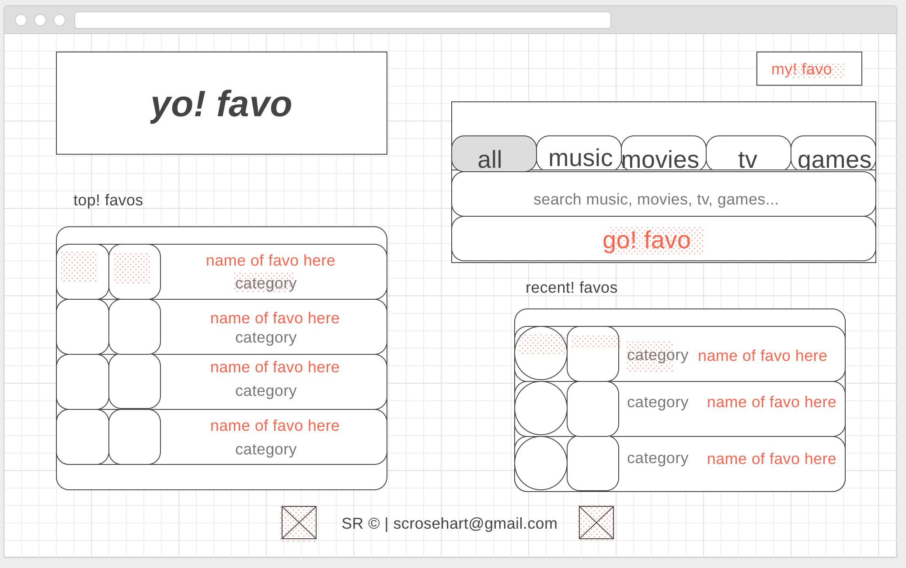
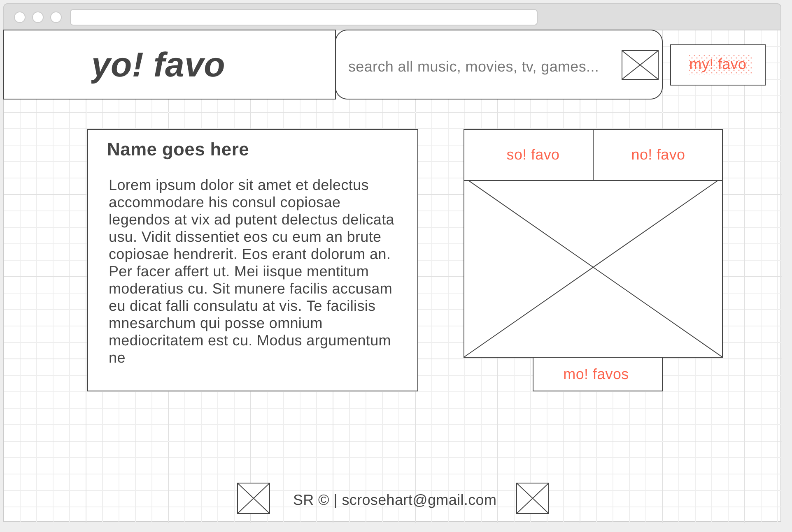
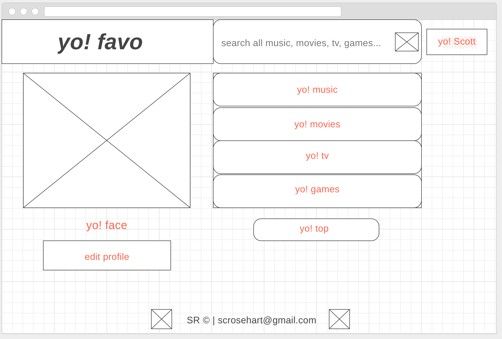
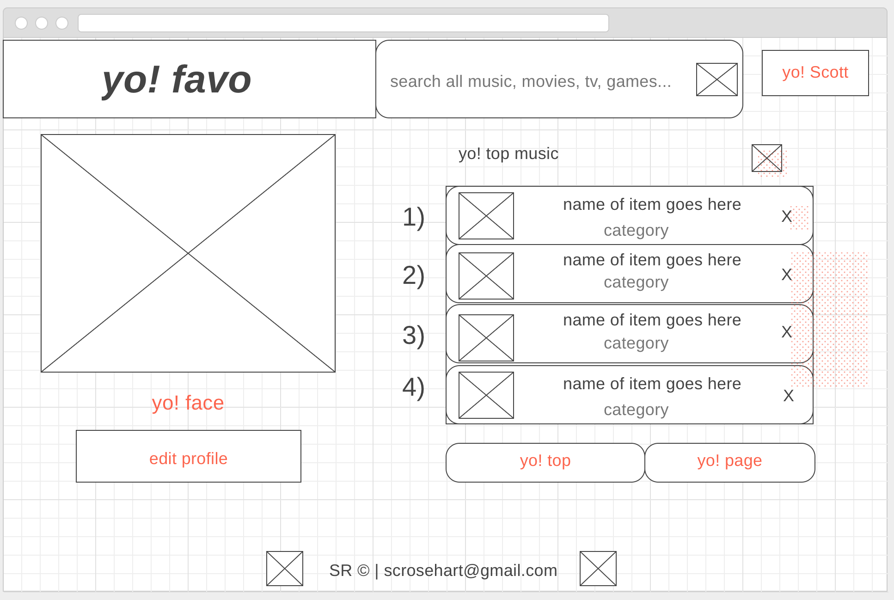
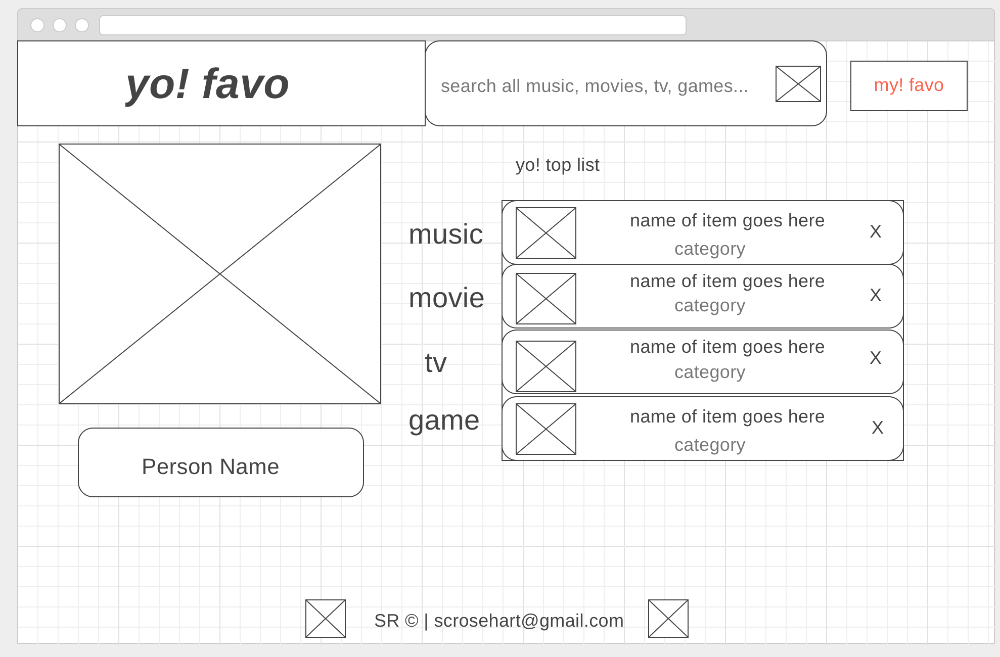
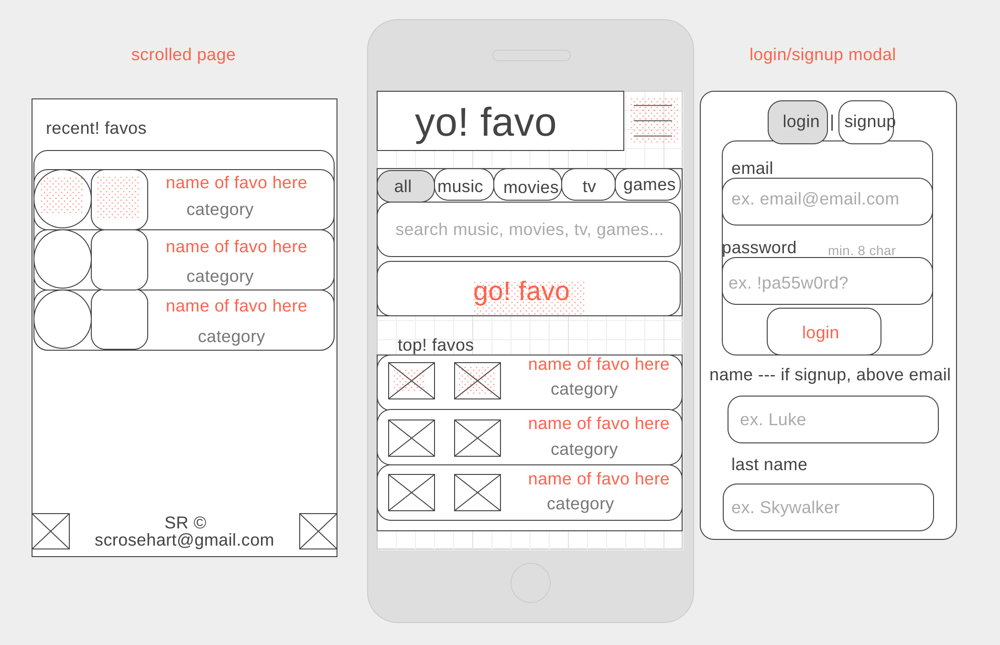
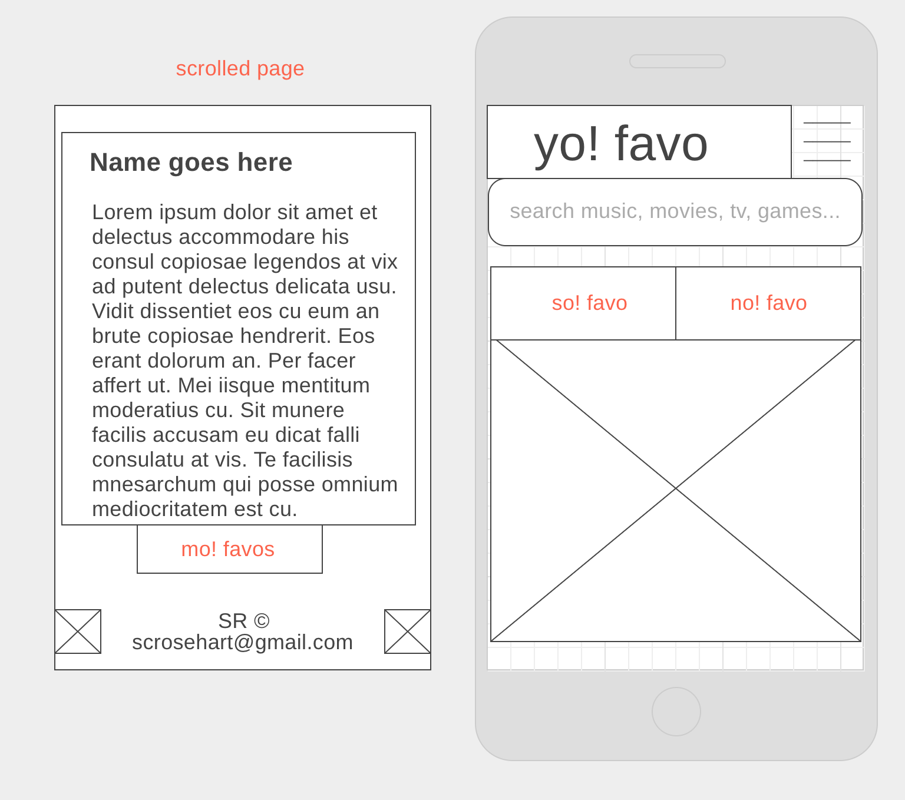
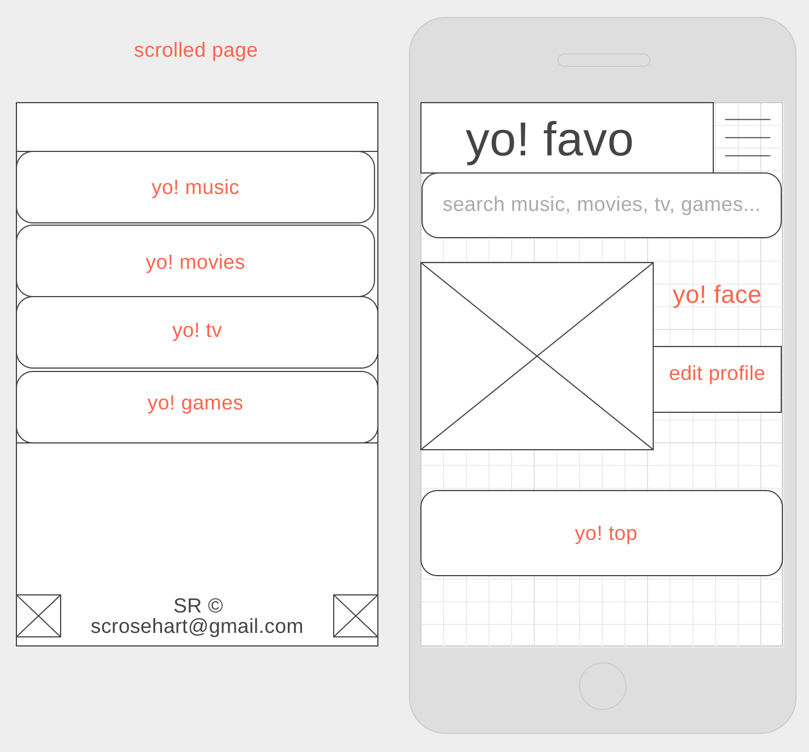
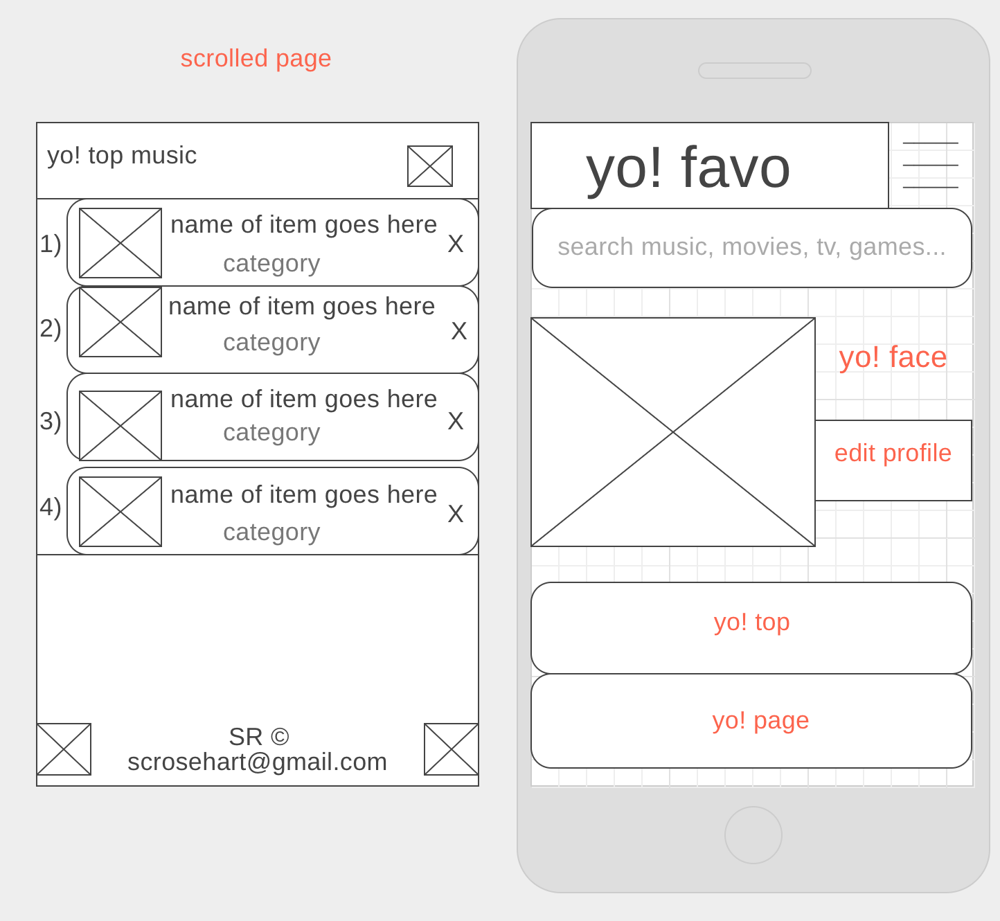
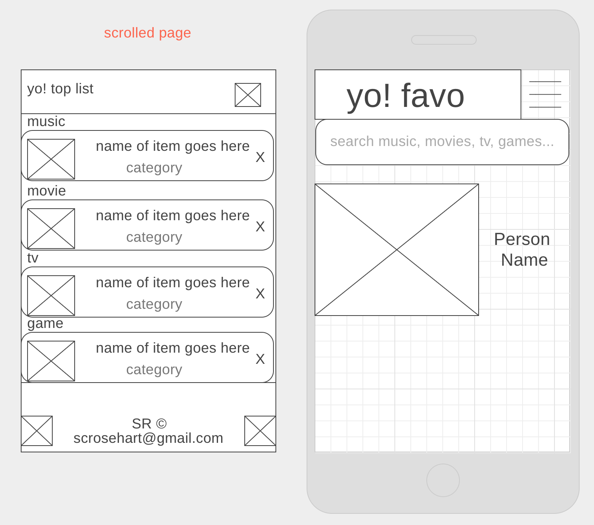

# yo!-favo

yo! favo is a web app for favoriting your top music, movies, tv shows, and games and then sharing them with your friends. It was created for Project 2 at General Assembly, WDI-17.

[LIVE SITE](https://yo-favo.herokuapp.com/)

---

## Wireframes

### Desktop

Landing page

Item page after search

Profile page

Profile top page

Profile category page

Profile update page

Profile shared page

### Mobile

Landing page

Item page after search

Profile page

Profile top page

Profile category page

Profile update page

Profile shared page

## Color Palette

Off White

Bright Yellow

Yellow

Dull Yellow

Dark Yellow

Coral

Bright Orange

Pink

Light Purple

Medium Purple

Dark Purple

Light Blue

Pale Mint

Mint

Deep Mint

Dark Teal

Extra Dark Teal

