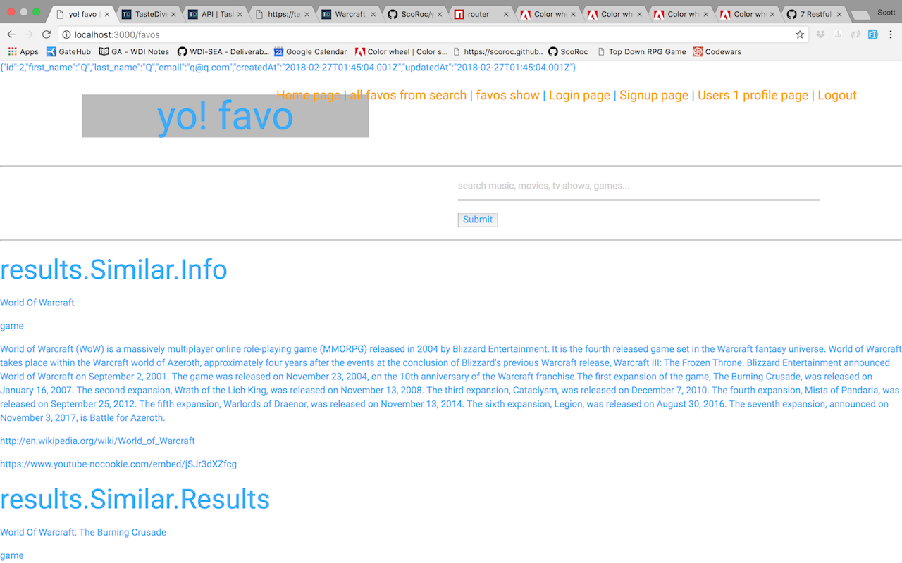
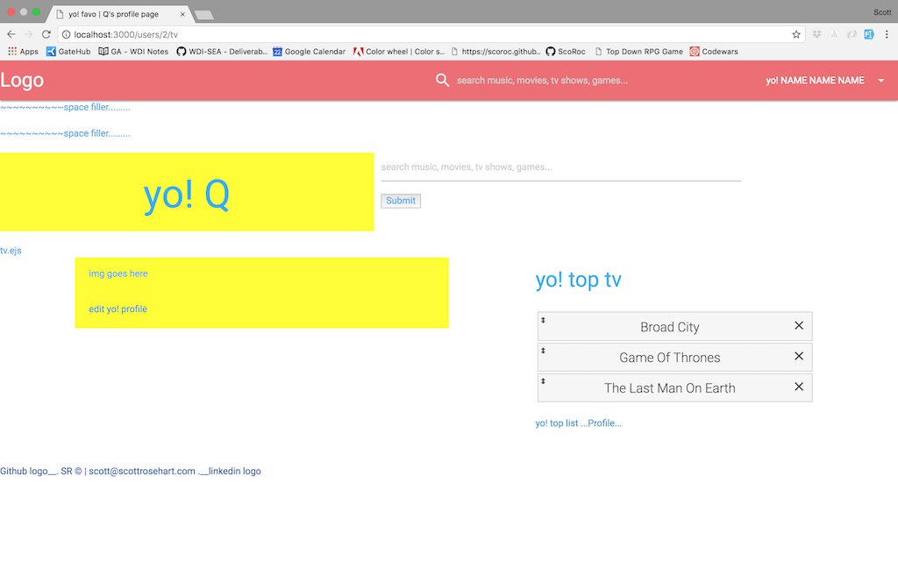

# yo!-favo

[yo! favo](https://yo-favo.herokuapp.com/) is a web app for favoriting your top music, movies, tv shows, and games - *called a __favo__* - and then sharing them with your friends. It was created for Project 2 at General Assembly, WDI-17 and hosted on Heroku at:

https://yo-favo.herokuapp.com/

yo!favo Homepage

### Jump to...

- [Technologies Used](https://github.com/ScoRoc/yo-favo#technologies-used)
- [Routes](https://github.com/ScoRoc/yo-favo#routes)
- [Models](https://github.com/ScoRoc/yo-favo#models)
- [APIs Used](https://github.com/ScoRoc/yo-favo#apis-used)
- [User Stories](https://github.com/ScoRoc/yo-favo#user-stories)
- [About the project](https://github.com/ScoRoc/yo-favo#about-the-project)
- [Styling/Animations](https://github.com/ScoRoc/yo-favo#styling--animations)
- [Wireframes](https://github.com/ScoRoc/yo-favo#wireframes)
- [Next Steps](https://github.com/ScoRoc/yo-favo#next-steps)
- [WIP Screenshots](https://github.com/ScoRoc/yo-favo#work-in-progress-screenshots)
- [Desktop Wireframe Images](https://github.com/ScoRoc/yo-favo#desktop)
- [Mobile Wireframe Images](https://github.com/ScoRoc/yo-favo#mobile)

---
## Technologies Used
[to the top](https://github.com/ScoRoc/yo-favo#yo-favo)

- HTML5 / CSS3
- JavaScript
- jQuery
- jQuery UI / Touch Punch
- Materialize
- Node.js
- Express
- EJS
- BCrypt
- Passport
- Session
- PostgresQL
- Sequelize

## Routes
[to the top](https://github.com/ScoRoc/yo-favo#yo-favo)

| CRUD   | ROUTE              | FUNCTIONALITY
|--------|--------------------|--------------
| GET    | /                  | Renders the home page for yo! favo
| GET    | /signup            | Renders the signup page
| POST   | /signup            | Adds a new user and redirects to the home page if successful. If an error occurred, redirects back to the signup page.
| GET    | /login             | Renders the login page
| POST   | /login             | Logs user in and redirects to home page upon success or back to the login page upon error.
| GET    | /logout            | Logs user out and redirects to the home page.
| GET    | /:name             | Renders the page for an individual favo after searching for it. This is where the API is queried.
| POST   | /favos             | Adds a favo to the user's favos list and redirects to the same page with the same info without re-querying the API.
| PUT    | /favos/order       | This is where the ranking of the favos are tracked after a users sorts them. Every time the user sorts their lists this route is called and updates the new order to the database.
| GET    | /:id/profile       | Renders the user's profile page and queries database to find the top ranked favo for each category. The database portion is handled using raw SQL. The user needs to be logged in to view this page. If not logged in, they are redirected to the login page.
| GET    | /:id/games         | Renders the user's top games page and queries the data base to gather a list of all the favos with category 'game' that they've favorited. The database portion is handled using raw SQL. The user needs to be logged in to view this page. If not logged in, they are redirected to the login page.
| GET    | /:id/movies        | Renders the user's top movies page and queries the data base to gather a list of all the favos with category 'movie' that they've favorited. The database portion is handled using raw SQL. The user needs to be logged in to view this page. If not logged in, they are redirected to the login page.
| GET    | /:id/music         | Renders the user's top music page and queries the data base to gather a list of all the favos with category 'music' that they've favorited. The database portion is handled using raw SQL. The user needs to be logged in to view this page. If not logged in, they are redirected to the login page.
| GET    | /:id/tv            | Renders the user's top tv page and queries the data base to gather a list of all the favos with category 'tv' that they've favorited. The database portion is handled using raw SQL. The user needs to be logged in to view this page. If not logged in, they are redirected to the login page.
| GET    | /:id/update        | Renders the profile update page where the user can edit their user info. The user needs to be logged in to view this page. If not logged in, they are redirected to the login page.
| PUT    | /:id/update        | Edits the user info on the database. The user needs to be logged in to view this page. If not logged in, they are redirected to the login page.
| GET    | /:id/public        | Renders the user's share page that doesn't require being logged in to view.
| DELETE | /:id/favos/:favoId | Deletes a favo from the user's favorite list. This actually deletes the entry from the join table, as the favo itself still remains in the database.

## Models
[to the top](https://github.com/ScoRoc/yo-favo#yo-favo)

#### favo

| id       | name   | type   | wTeaser | wUrl   | yUrl
|----------|--------|--------|---------|--------|------
| auto-gen | string | string | text    | string | string

#### user
| id       | first_name | last_name | email  | password
|----------|------------|-----------|--------|---------
| auto-gen | string     | string    | string | hashed string

#### favos_users
###### Although this is the join table, I added the order column to make the associations I needed. This order column needed to be accessed using raw SQL in my routes

| id       | userId  | favoId  | order
|----------|---------|---------|------
| auto-gen | integer | integer | integer

## APIs Used
[to the top](https://github.com/ScoRoc/yo-favo#yo-favo)

[Taste D!ve](https://tastedive.com/read/api) is the API that was used for this project. It is a website that allows you to search for music, movies, tv shows, games, and books and then get recommendations based on your liked items. The API will return the results of your search along with recommendations. Each result includes the Name of the item searched, the Category it falls under, a Teaser snippet from Wikipedia, a Wikipedia Url, and a YouTube Url.

## User Stories
[to the top](https://github.com/ScoRoc/yo-favo#yo-favo)

1. ) As a lover of entertainment, I am constantly listening to new music, watching new movies and tv shows, and playing new games. I don't want to go to multiple places to share my current interests, so having one place to share everything I'm currently into is convenient and provides a snapshot of my likes at a given moment.

2. ) I like to keep track of all of the recent movies and games I've watched so I can recommend them to all of my friends. I don't want to bombard them with links and with my busy schedule I can't be burdened of navigating multiple plaes to track this. With yo! favo, I can easily add my favorites, sort them, and share them with my friends - and I can do it from any device!

## About the project
[to the top](https://github.com/ScoRoc/yo-favo#yo-favo)

This project was kicked off the same weekend I was going to go see [Lettuce](http://www.lettucefunk.com/) - killer funk band, AMAZING live. Go see them, seriously. I wanted to share them with a couple of friends and my first reaction was to go to Spotify and share from there. I then had the idea to have a whole favorites site that you can share with your friends. As opposed to being able to only share music on Spotify or movies/tv on Netflix/Hulu, I wanted a way to include all of your favorite items in one place. You can easily update this and send the page to your friends so they can see what your into at the moment, be it that day, week, month, or however often you want to set your favorites.

This app was designed to be simple on the outside but more complicated under the hood. I want to have a great user experience, giving the user everything they would want without getting in their way. Part of this user experience is responsiveness. Users come to expect a lot from modern apps because of the plethora of great apps and advanced technologies out there are today. This meant I had to do equal amounts of work on the front and back end of this project in order to get it to be an easy-to-use site for all devices that would deliver to the user what they want.

#### The pages

As mentioned, this app is simple at first glance. When you first reach the site you come to the landing page from which you can either login or search for a favo. There isn't much on this page except for the logo, footer, and navbar. From here, a user can either login, signup, or search for a favo. Login and Signup each have their own page. After searching for a favo, a user will be brought to the individual favo page that displays the favo's name and category, a short description and an embeded YouTube video. There is a button to add this favo to the user's favo list. If you are not logged in you will be redirected to the login page, otherwise you will remain on the same page.

Upon logging in, you will be allowed access to your profile page, which will display the user's name. This page displays your top favo from each category and clicking on a favo name will take you to that item's page. A user has a top list in each category and can find this list via the navbar with each category having it's own page. Each category page has a list of all of the favos that the user has added and they are able to sort them by simply dragging. The order number updates automatically and a user is able to delete an item by clicking on the X.

A user is able to edit their profile from any profile page by clicking on the update link, and can then update their First Name, Last Name, or Email, each field pre-populating with their existing info. A user can also click on the share link to go to their share page. This page does not require a user to be logged in and is meant for a user to send this link to their friends. This page displays the user's name so you know what page you're looking at and it will still update their top favos in real-time so you only ever have to send the link once.

The entire site is mobile friendly and responds well to any device used. The actual layout will shift depending on screen size in addition to many items - boxes, text, graphics - being scalable.

A small, but user pleasing detail is the fact that each tab will accurately display which page you're on and the user's name, if relevant.

##### The Navbar

 The navbar, which is a constant theme throughout the site, has two iterations - one for desktop and one optimized for mobile. The navbar will display different links depending on the user's state.

 On desktop, the navbar has a logo in the top left which brings the user to the homepage when clicked on. The center has the search bar from where users can search for a favo. The right side has either one or two dropdowns, depending on login state. If a user is not logged in then there is only a menu dropdown that displays Home, Login, and Signup. If the user is logged in, the menu will additionally display Profile as well as having a second dropdown next to the menu. The new dropdown displays music, movies, tv, and games so the user can navigate to each of their top category pages.

The navbar adjust for mobile, with two major changes. The first is that the dropdowns become a sidenav that slides out from the right upon either clicking on the hamburger or swiping from the right edge of the screen. The second is that the search bar turns into a search icon that the user touches to bring up the search box.

## Styling / Animations
[to the top](https://github.com/ScoRoc/yo-favo#yo-favo)

Perhaps one of the most important part of any product is it's style. If a user does not want to use something, they won't use it no matter how many features are packed in. Because of this, I wanted to design a website that would be engaging in color, layout, usage, and animations. Small details, like the footer having a triangular shape at it's top and appearing as though light is shining from one side of it's top to the other, engages the user and keeps them wanting to come back.

#### Custom Built Animations
[Logo](https://github.com/ScoRoc/yo-favo#logo) | [Navbar Logo](https://github.com/ScoRoc/yo-favo#navbar-logo) | [FABs](https://github.com/ScoRoc/yo-favo#fabs-fixed-action-buttons-in-the-bottom-right-hand-corner) | [LinkedIn FAB](https://github.com/ScoRoc/yo-favo#linkedin) | [Github FAB](https://github.com/ScoRoc/yo-favo#github) | [Codepen FAB](https://github.com/ScoRoc/yo-favo#codepen) | [Soundcloud FAB](https://github.com/ScoRoc/yo-favo#soundcloud) | [Mobile Search Box Popup](https://github.com/ScoRoc/yo-favo#mobile-search-box) | [Add Favo Button](https://github.com/ScoRoc/yo-favo#add-favo-button) | [Submit Buttons](https://github.com/ScoRoc/yo-favo#submit-buttons-loginsignup-pages) | [Color Palette](https://github.com/ScoRoc/yo-favo#color-palette)

##### Logo

[Animation/Styling menu](https://github.com/ScoRoc/yo-favo#custom-built-animations)

The main logo on the home page was designed to be sort of throwback, with blocked out shapes and bright colors; each color ties into the color of each favo. The entire logo sits on a slightly translucent backdrop to separate it from the page. The shapes are flat on the backdrop without box-shadow. However, notice as the shapes edge off the side of the backdrop they actually gain a deeper box-shadow than the backdrop. This is to make you feel like there actually is some dimension, even though they appear 2D at first glance. The logo has 4 animations that it loops through. The shapes do the same movement each time, simply shifting positions - though the blue circle does turn purple during the third loop. The logo itself does three different things: 1) flips around it's x axis 360 degrees, 2) grows inside and gains an outline, and 3) shrinks in size to fit inside the yellow shape and moves with it across the logo field.

##### Navbar Logo

[Animation/Styling menu](https://github.com/ScoRoc/yo-favo#custom-built-animations)

  

A smaller version of the logo that stays with the user on each page, including mobile. Hovering the mouse over the logo or holding your finger on this logo will trigger it's animation. The logo appears as one item on the navbar but after triggering the animation it splits into 3 sections. The box and shapes inside it grow in size and rotate -15 degrees. The word 'yo' rotates and grows the same but as the box/shapes but it pops out of the box and sits below it after the rotation. The word 'favo' grows the same but rotates even farther at -90 degrees. It also moves slightly to line up it's 'o' with the 'o' in yo. All of the colors for the entire logo shift during this animation.

##### FABs (Fixed Action Buttons in the bottom right hand corner)

[Animation/Styling menu](https://github.com/ScoRoc/yo-favo#custom-built-animations)

Although the FAB is a default Materialize item, I wanted to break away from Materialize's feel by giving each sub FAB their own animation. Upon hovering the main FAB, the other FABs show up and reveal their first animation: each FAB grows and shrinks bringing the user's eye to them. Hovering each sub FAB reveals their own additional animation.

###### LinkedIn

[Animation/Styling menu](https://github.com/ScoRoc/yo-favo#custom-built-animations)

This FAB breaks away from it's box-shadow and zooms out of view to the right, then back on screen from the left. The box-shadow does the opposite.

###### Github

[Animation/Styling menu](https://github.com/ScoRoc/yo-favo#custom-built-animations)

This FAB grows and rotates in a rocking manner.

###### Codepen

[Animation/Styling menu](https://github.com/ScoRoc/yo-favo#custom-built-animations)

This FAB blurs to the point where you can barely see it and then becomes transparent. While invisible, it shifts to a position above where it first was and then becomes opaque again. The blur is reduced to reveal the FAB and then it slowly drops down back into place. This animation gives a vanish/reveal magic trick sort of vibe.

###### Soundcloud

[Animation/Styling menu](https://github.com/ScoRoc/yo-favo#custom-built-animations)

Being that this is a link to my band's Soundcloud, I thought it fitting to have music notes float upwards from this FAB upon hover. Each music note fades to 100% transparency and returns to the base only to float up again, providing a seemingly never-ending stream of notes.

##### Mobile Search Box

[Animation/Styling menu](https://github.com/ScoRoc/yo-favo#custom-built-animations)

On mobile, the search box turns into a search button which the user must touch to bring up. I wanted to keep the mobile view clean and removing the search box seemed the way to go. Once the user touches search icon, the search box appears and the rest of the screen dims to bring the user's focus to the search box. The user can either type in the box and hit enter or they can touch outside the box to close it.

##### Add Favo Button

[Animation/Styling menu](https://github.com/ScoRoc/yo-favo#custom-built-animations)

  

This button starts off mostly flat and purple. The first animation has the edges start to glow red and then the button pulses an orange/yellow border to call attention to it. Upon hovering over it the colors invert and the rectangle turns into an oval.

##### Submit Buttons (Login/Signup pages)

[Animation/Styling menu](https://github.com/ScoRoc/yo-favo#custom-built-animations)

  

These are much simpler animations where the colors just invert and the button grows slightly upon hovering.

#### Color Palette

[Animation/Styling menu](https://github.com/ScoRoc/yo-favo#custom-built-animations)

Here are all of the colors used in the project:

   

   

   

   

## Wireframes
[to the top](https://github.com/ScoRoc/yo-favo#yo-favo)

- [Desktop](https://github.com/ScoRoc/yo-favo#landing-page) | [Mobile](https://github.com/ScoRoc/yo-favo#landing-page-1) | **Landing Page:** home page of the entire site
- [Desktop](https://github.com/ScoRoc/yo-favo#item-page-after-search) | [Mobile](https://github.com/ScoRoc/yo-favo#item-page-after-search-1) | **Search Page:** the page rendered after searching for a favo
- [Desktop](https://github.com/ScoRoc/yo-favo#profile-page) | [Mobile](https://github.com/ScoRoc/yo-favo#profile-page-1) | **Profile Page:** original idea for the main user profile page
- [Desktop](https://github.com/ScoRoc/yo-favo#profile-top-page) | [Mobile](https://github.com/ScoRoc/yo-favo#profile-top-page-1) | **Profile Top List Page:** original idea for a users top list page, which ended up becoming the main user profile page
- [Desktop](https://github.com/ScoRoc/yo-favo#profile-category-page) | [Mobile](https://github.com/ScoRoc/yo-favo#profile-category-page-1) | **Profile Top Category Page:** user profile page showing their favos for a specific category
- [Desktop](https://github.com/ScoRoc/yo-favo#profile-update-page) | [Mobile](https://github.com/ScoRoc/yo-favo#profile-update-page-1) | **Profile Update Page:** the page where a user can update their info
- [Desktop](https://github.com/ScoRoc/yo-favo#profile-shared-page) | [Mobile](https://github.com/ScoRoc/yo-favo#profile-shared-page-1##### ) | **Profile Shared Page:** unauthenticated page showing a user's top list - meant as a page to share your favos with your friends because you can't change anything and you don't need to be logged in to view it

Because of the length, the images of the wireframes are the last things on the README, after all other content.

## Next Steps
[to the top](https://github.com/ScoRoc/yo-favo#yo-favo)

There quite a few features I'd like to add in here. The more immediate ones being the homepage showing the most recently favorited item as well as the highest favorited item. I would also like to be able to show recommendations to similar items on each item's searched page. In addition, I'd like to show recommendations to the user on their own profile page.

A more lofty goal would be to integrate other sites with this app. For example, linking your Spotify, Hulu, Netflix, and Steam accounts would allow you to favorite items you've watched/listened to/played or conversely, if you favorite one on yo! favo it would allow you to automatically add it to your other appropriate account.

## Work In Progress Screenshots
[to the top](https://github.com/ScoRoc/yo-favo#yo-favo)

Here is a collection of screenshots throughout the week of various stages on various pages. This will give you a glimpse of what the app looked like from the start to the end.

[Initial homepage](https://github.com/ScoRoc/yo-favo#initial-homepage-showing-api-results) | [Initial profile page](https://github.com/ScoRoc/yo-favo#initial-profile-page) | [Category page with sortable element](https://github.com/ScoRoc/yo-favo#top-category-page-with-sortable-element) | [Mobile category page with sortable](https://github.com/ScoRoc/yo-favo#mobile-top-category-page-with-sortable-element) | [Row/Column blockout for styling](https://github.com/ScoRoc/yo-favo#blocking-out-the-rows-and-columns-for-styling-purposes) | [Nearly finished homepage](https://github.com/ScoRoc/yo-favo#nearly-completed-landing-page)

##### Initial homepage showing API results:
[WIP screenshot menu](https://github.com/ScoRoc/yo-favo#work-in-progress-screenshots) | [to the top](https://github.com/ScoRoc/yo-favo#yo-favo)

##### Initial profile page:

[WIP screenshot menu](https://github.com/ScoRoc/yo-favo#work-in-progress-screenshots) | [to the top](https://github.com/ScoRoc/yo-favo#yo-favo)

##### Top category page with sortable element:

[WIP screenshot menu](https://github.com/ScoRoc/yo-favo#work-in-progress-screenshots) | [to the top](https://github.com/ScoRoc/yo-favo#yo-favo)

##### Mobile top category page with sortable element:

[WIP screenshot menu](https://github.com/ScoRoc/yo-favo#work-in-progress-screenshots) | [to the top](https://github.com/ScoRoc/yo-favo#yo-favo)

##### Blocking out the rows and columns for styling purposes:

[WIP screenshot menu](https://github.com/ScoRoc/yo-favo#work-in-progress-screenshots) | [to the top](https://github.com/ScoRoc/yo-favo#yo-favo)

##### Nearly completed landing page:

[WIP screenshot menu](https://github.com/ScoRoc/yo-favo#work-in-progress-screenshots) | [to the top](https://github.com/ScoRoc/yo-favo#yo-favo)

*END of content. Wireframe images below*

### Desktop
[to the top](https://github.com/ScoRoc/yo-favo#yo-favo)

Desktop wireframes

##### Landing page
[Wireframe Menu](https://github.com/ScoRoc/yo-favo#wireframes) | [Mobile version](https://github.com/ScoRoc/yo-favo#landing-page-1) | [to the top](https://github.com/ScoRoc/yo-favo#yo-favo)

##### Item page after search
[Wireframe Menu](https://github.com/ScoRoc/yo-favo#wireframes) | [Mobile version](https://github.com/ScoRoc/yo-favo#item-page-after-search-1) | [to the top](https://github.com/ScoRoc/yo-favo#yo-favo)

##### Profile page
[Wireframe Menu](https://github.com/ScoRoc/yo-favo#wireframes) | [Mobile version](https://github.com/ScoRoc/yo-favo#profile-page-1) | [to the top](https://github.com/ScoRoc/yo-favo#yo-favo)

##### Profile top page
[Wireframe Menu](https://github.com/ScoRoc/yo-favo#wireframes) | [Mobile version](https://github.com/ScoRoc/yo-favo#profile-top-page-1) | [to the top](https://github.com/ScoRoc/yo-favo#yo-favo)

##### Profile category page
[Wireframe Menu](https://github.com/ScoRoc/yo-favo#wireframes) | [Mobile version](https://github.com/ScoRoc/yo-favo#profile-category-page-1) | [to the top](https://github.com/ScoRoc/yo-favo#yo-favo)

##### Profile update page
[Wireframe Menu](https://github.com/ScoRoc/yo-favo#wireframes) | [Mobile version](https://github.com/ScoRoc/yo-favo#profile-update-page-1) | [to the top](https://github.com/ScoRoc/yo-favo#yo-favo)

##### Profile shared page
[Wireframe Menu](https://github.com/ScoRoc/yo-favo#wireframes) | [Mobile version](https://github.com/ScoRoc/yo-favo#profile-shared-page-1##### ) | [to the top](https://github.com/ScoRoc/yo-favo#yo-favo)

---

### Mobile
[to the top](https://github.com/ScoRoc/yo-favo#yo-favo)

Mobile wireframes

##### Landing page
[Wireframe Menu](https://github.com/ScoRoc/yo-favo#wireframes) | [Desktop version](https://github.com/ScoRoc/yo-favo#landing-page) | [to the top](https://github.com/ScoRoc/yo-favo#yo-favo)

##### Item page after search
[Wireframe Menu](https://github.com/ScoRoc/yo-favo#wireframes) | [Desktop version](https://github.com/ScoRoc/yo-favo#item-page-after-search) | [to the top](https://github.com/ScoRoc/yo-favo#yo-favo)

##### Profile page
[Wireframe Menu](https://github.com/ScoRoc/yo-favo#wireframes) | [Desktop version](https://github.com/ScoRoc/yo-favo#profile-page) | [to the top](https://github.com/ScoRoc/yo-favo#yo-favo)

##### Profile top page
[Wireframe Menu](https://github.com/ScoRoc/yo-favo#wireframes) | [Desktop version](https://github.com/ScoRoc/yo-favo#profile-top-page) | [to the top](https://github.com/ScoRoc/yo-favo#yo-favo)

##### Profile category page
[Wireframe Menu](https://github.com/ScoRoc/yo-favo#wireframes) | [Desktop version](https://github.com/ScoRoc/yo-favo#profile-category-page) | [to the top](https://github.com/ScoRoc/yo-favo#yo-favo)

##### Profile update page
[Wireframe Menu](https://github.com/ScoRoc/yo-favo#wireframes) | [Desktop version](https://github.com/ScoRoc/yo-favo#profile-update-page) | [to the top](https://github.com/ScoRoc/yo-favo#yo-favo)

##### Profile shared page
[Wireframe Menu](https://github.com/ScoRoc/yo-favo#wireframes) | [Desktop version](https://github.com/ScoRoc/yo-favo#profile-shared-page) | [to the top](https://github.com/ScoRoc/yo-favo#yo-favo)

[to the top](https://github.com/ScoRoc/yo-favo#yo-favo)
